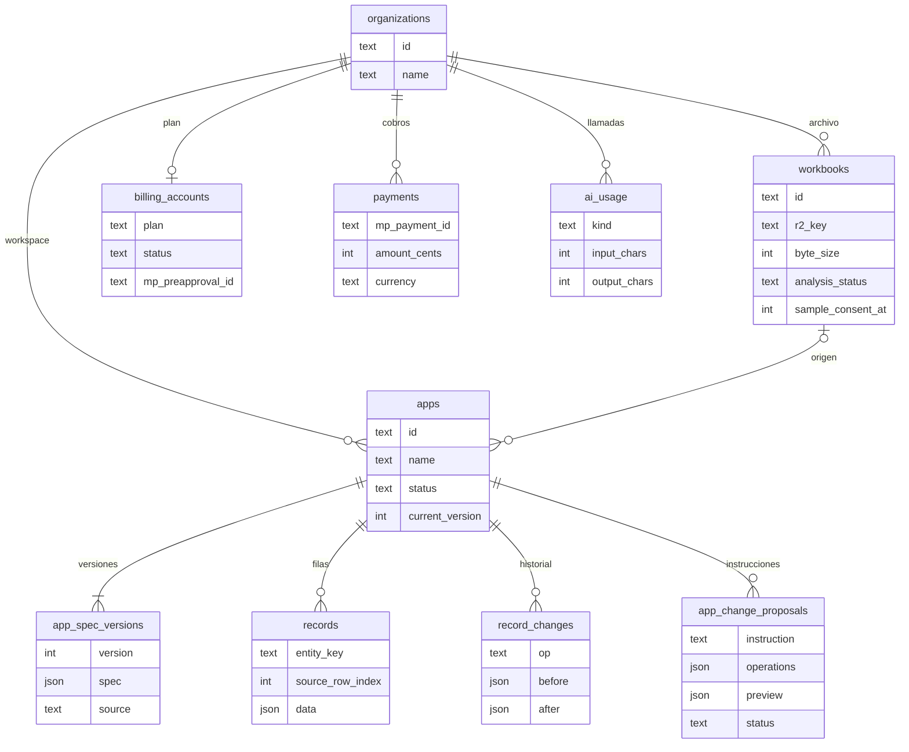
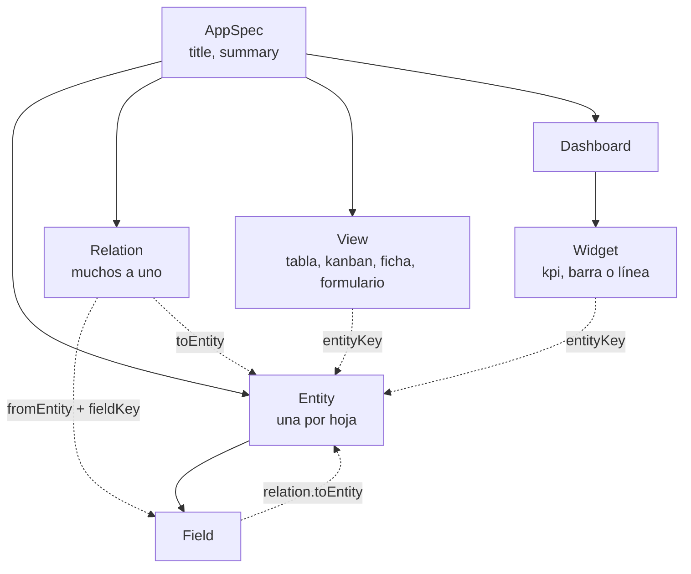

# Estructura de datos de las apps

Una app no es una tabla por hoja. Es una fila en `apps`, una spec versionada en JSON y las filas de todas las hojas juntas en `records`, separadas por `entity_key`.

El archivo `.xlsx` queda en R2. En D1 se guardan la clave (`workbooks.r2_key`) y el tamaño (`workbooks.byte_size`).

## Dónde vive una app

`apps.status` es `draft` o `published`. `apps.current_version` apunta a la spec que está en uso. En `0` todavía no hay spec.

`workbooks.analysis_status` es `pending`, `processing`, `completed` o `failed`. `sample_consent_at` es el opt-in para mandar valores de celdas al modelo. `byte_size` es el tamaño del `.xlsx` en R2.

`ai_usage` registra cada llamada al modelo que devolvió respuesta (`analyze` o `evolve`), con caracteres de entrada y salida. No guarda el texto.

`billing_accounts` es una fila por workspace. Al crear la cuenta nace en `free` / `none`. `payments` guarda cobros de Mercado Pago cuando existan.

`app_spec_versions.source` dice quién escribió esa versión: `heuristic`, `ai`, `wizard`, `instruction` o `restore`.

`records.data` es un objeto. Las claves son las `key` de los campos de la spec, no columnas de SQL. `source_row_index` es el orden de la fila en la hoja de origen. Una fila creada en la app lo deja en null.

`app_change_proposals.status` es `pending`, `processing`, `applied`, `rejected`, `failed` o `stale`.

`record_changes` guarda el antes y el después de cada alta, edición o borrado. Si el cambio vino de una instrucción aplicada, lleva `proposal_id`.

Borrar la app borra en cascada versiones, filas, historial y propuestas. El archivo de R2 se borra si ninguna otra app usa ese workbook.

## Qué hay dentro de la spec

La spec es un JSON de versión `2`. No hay tablas para entidades, campos ni widgets: todo eso está dentro de `app_spec_versions.spec`.

**Entity.** `key` estable, `name` visible, `sourceSheet` (nombre de la hoja, o null si nació de una instrucción). `primaryFieldKey` es la columna que identifica la fila. `statusFieldKey` habilita el kanban. Si no hay estado, es null.

**Field.** `key` y `label`. El tipo es uno de: texto, texto largo, número, monto, fecha, booleano, email, teléfono, url, estado, categoría, identificador, relación o calculado. También marca si es obligatorio, visible, editable, sensible o de categoría especial. Estado y categoría pueden traer `options`. Un monto puede traer `currency`. Una relación apunta a otra entidad. Un calculado guarda `formula` y no se edita.

**Relation.** Siempre muchos-a-uno: un campo de una entidad apunta a otra. Se escribe `detected` (análisis) o `instruction` (evolución). El tipo también admite `manual`, pero el wizard no agrega relaciones a mano.

**View.** Pertenece a una entidad. Tipo `table`, `kanban`, `detail` o `form`. Puede filtrar, ordenar, agrupar y elegir campos visibles.

**Dashboard.** Una lista de widgets. Cada uno cuenta, suma o promedia un campo de una entidad, y puede agrupar o partir por mes. Tipos: `kpi`, `bar`, `line`.

Las filas no repiten esa estructura. Una fila de la hoja Septiembre es un `records` con `entity_key` de esa entidad y `data` como `{ nafta: 1200, ute: 800 }`.
