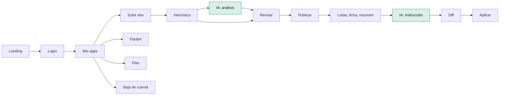
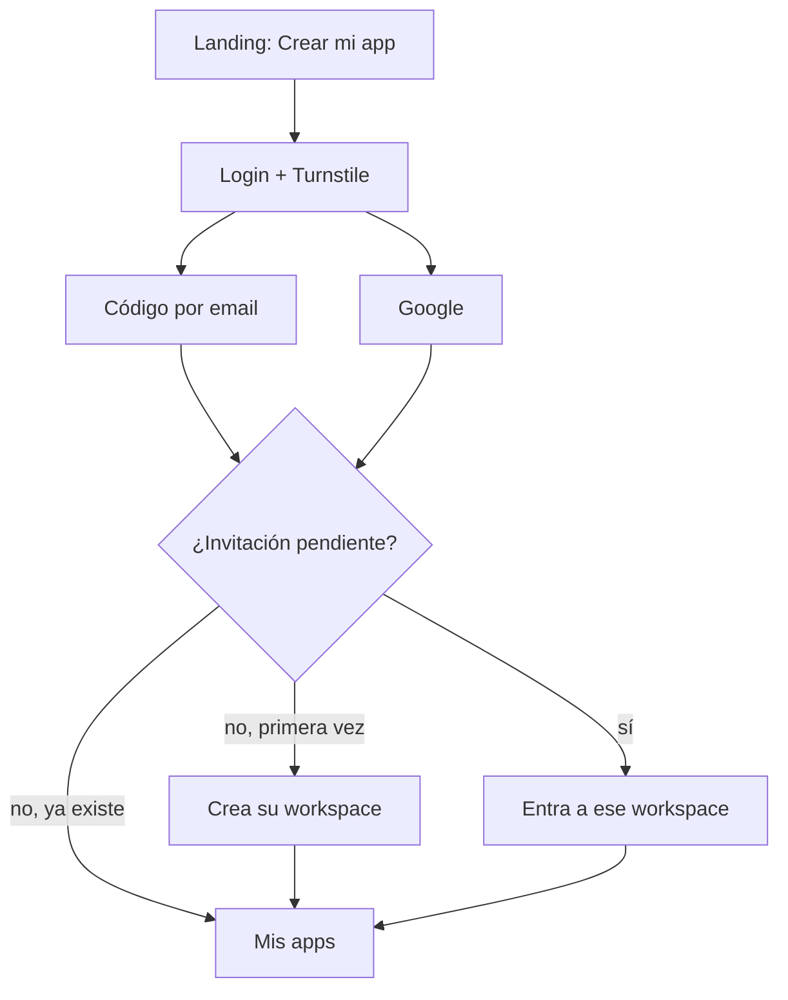
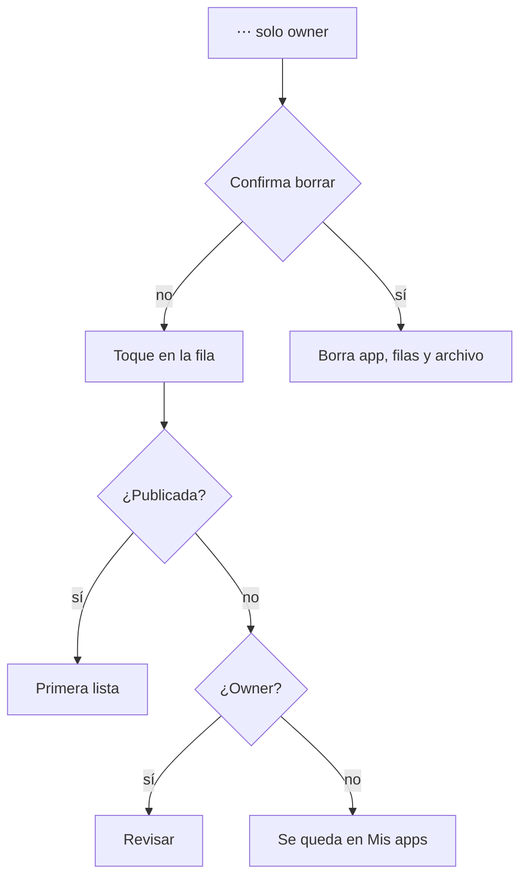
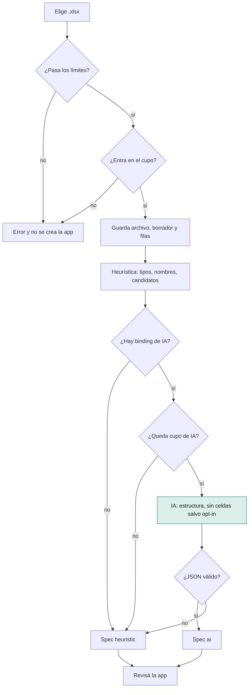
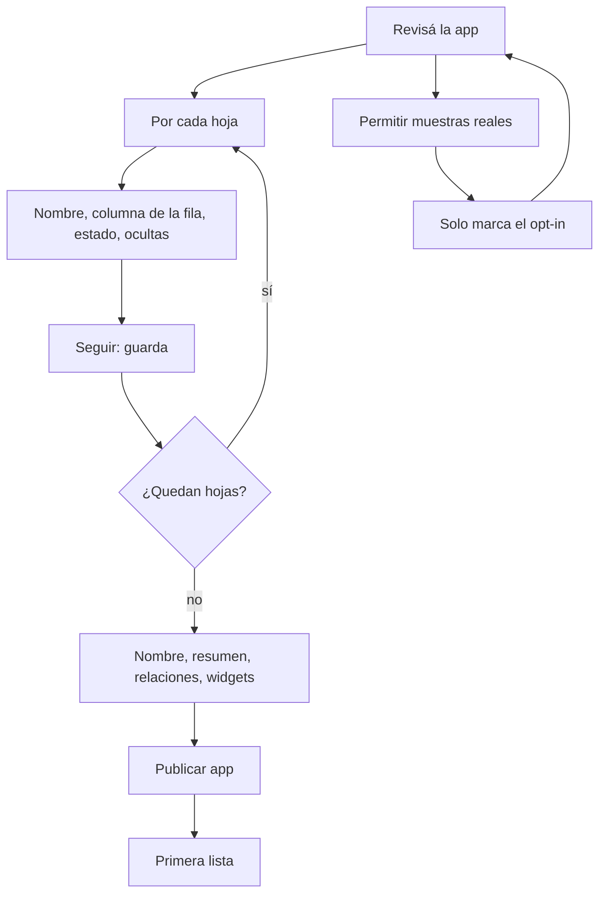
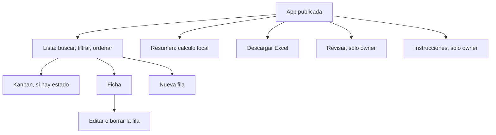
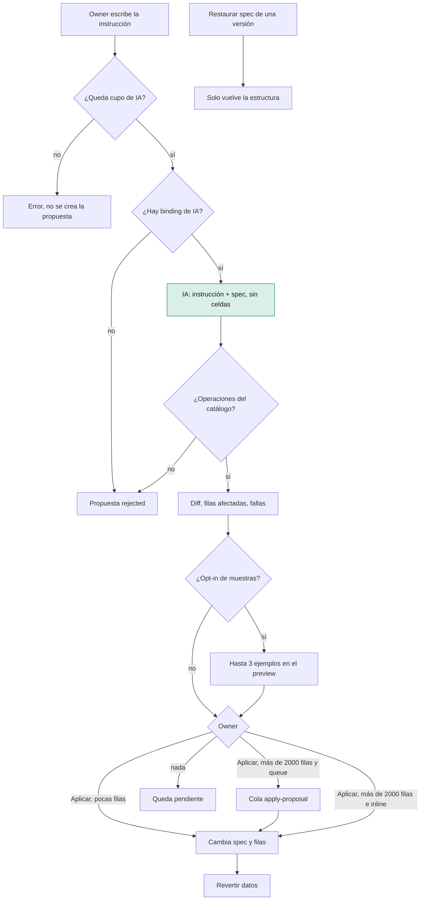
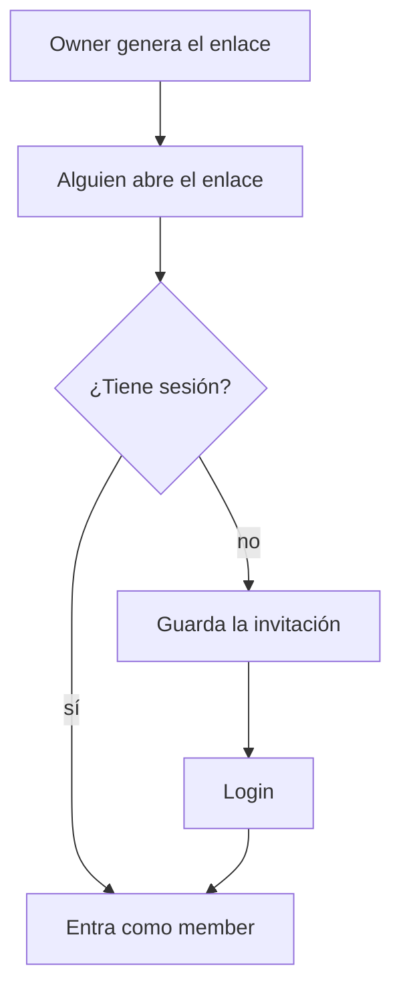
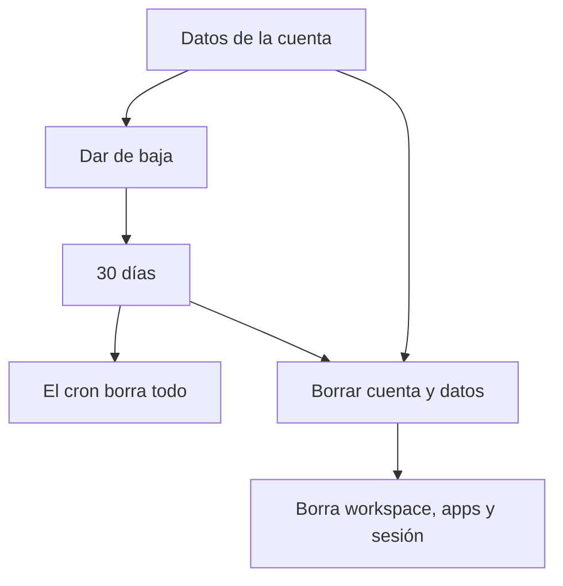

# Flujos actuales

Mapa de lo que el usuario puede hacer hoy en el workspace. **IA** marca el único modelo (`@cf/meta/llama-3.1-8b-instruct-fast` vía Workers AI). Si el binding no está, o la llamada falla, esa parte sigue sin modelo.

Hay dos momentos con IA: el análisis de la planilla y la instrucción para evolucionar la app. El resto no llama al modelo. En los diagramas, ese paso va en verde.

Roles: **owner** (dueño del workspace) y **member** (invitado). La app se usa con login, dentro del workspace. No hay URL pública.

## 1. Entrar

Landing → «Crear mi app» abre el workspace.

En `/login` hay dos caminos. Los dos piden Turnstile antes de seguir. Turnstile no es el modelo.

1. **Código por email.** Se ingresa el mail, llega un código de 6 dígitos (en local se imprime en la consola; en producción lo manda `send.cfemailer.com`) y al verificarlo se crea la sesión. El primer ingreso crea el workspace a nombre de ese mail.
2. **Google.** OAuth y, si es la primera vez, el mismo alta de workspace.

Si el navegador trae una invitación pendiente, al terminar el login entra a ese workspace en lugar de crear uno nuevo. El primer workspace crea también `billing_accounts` en plan `free` y estado `none`.

Cerrar sesión vuelve a `/login`.

## 2. Inicio: Mis apps

`/` lista las apps del workspace. El estado visible es Analizando, El análisis falló, Falta revisar o Publicada.

El owner: Analizando, El análisis falló o Falta revisar abre la revisión; Publicada abre la primera lista. El member solo entra a las publicadas; un toque en un borrador no abre la revisión.

El owner ve **⋯ → Borrar**. Eso elimina la app, las filas y el archivo. Pide confirmación.

Ahí también está subir otro `.xlsx`, el enlace a Plan, el de Equipo y la baja de la cuenta (sección 9). El owner ve **Consumo**: llamadas de IA del mes (tope 100), espacio de los `.xlsx` (tope 100 MB) y filas en D1 (tope 50.000).

## 3. Subir una planilla

Solo el owner, y solo si el workspace no está dado de baja.

1. Elige un `.xlsx`. El aviso del art. 17 está en esa tarjeta: no subir datos de salud, religión, política, afiliación sindical, vida sexual u origen étnico.
2. Mientras el request no vuelve, la pantalla muestra tres pasos: subiendo el archivo, leyendo las hojas, consultando el modelo. Es un avance por tiempo. No sabe todavía si el modelo va a responder.
3. El archivo se valida (contenedor xlsx, hasta 10 hojas, 200 columnas, 10.000 filas, 10 MB) y se compara con el cupo del workspace (100 MB de archivos y 50.000 filas). Si no entra, no se escribe R2 ni D1.
4. Si entra, se guardan el archivo, la app en borrador y las filas.
5. Arranca el análisis. En local corre en el mismo request. En producción entra a la cola y la revisión recarga sola cada 4 segundos.

**IA — análisis.** Después de armar una spec heurística (tipos, nombres, candidatos de relación a partir de las columnas), si hay binding y queda cupo de IA se llama al modelo. El prompt lleva nombre de archivo, hojas, perfil de columnas y candidatos de relación. No lleva valores de celdas, salvo que esa planilla tenga opt-in de muestras (sección 4). Columnas marcadas sensibles o de categoría especial no se envían ni con opt-in. La respuesta tiene que ser JSON con título, resumen, entidades y relaciones, y no puede inventar columnas. Si responde bien, la spec queda con origen `ai`. Si no hay binding, no hay cupo, falla o el JSON no sirve, queda la heurística (`heuristic`). La revisión muestra cuál de los dos fue.

Al terminar, el owner cae en **Revisá la app**.

## 4. Revisar y publicar

Solo el owner. Un member que abre un borrador vuelve a Mis apps. Si entra a `/setup` de una app ya publicada, cae en la primera lista.

La frase de la pantalla es la tarea: confirmar qué es cada lista, qué columna identifica la fila, si hay un estado y qué columnas ocultar. No se editan las celdas.

Por cada hoja:

- Nombre de la lista.
- Columna que identifica la fila.
- Columna de estado, o ninguna. Si hay estado, después existe vista kanban.
- Columnas ocultas. Las sensibles no aparecen en esa lista.

**Seguir** guarda la spec y pasa a la hoja siguiente.

**Permitir muestras reales** no reanaliza. Solo marca el opt-in en esa planilla. Un análisis posterior (el endpoint existe, la pantalla no lo dispara) podría mandar hasta 25 filas de la app, 5 por hoja. Sin ese opt-in, el modelo no ve valores.

Al terminar las hojas, una pantalla de cierre:

- Nombre de la app y para qué sirve.
- Relaciones detectadas. Se pueden quitar, no agregar a mano.
- Widgets del resumen. Se pueden sacar.

**Publicar app** deja la app publicada y abre la primera lista. Si alguna relación no matchea filas, avisa cuáles quedaron sin vínculo.

Desde una app ya publicada, el owner puede volver a entrar por **Revisar** en la navegación.

## 5. Usar la app

Entra quien tiene sesión en el workspace. La navegación son las listas, Resumen (si hay widgets) y Excel. Para el owner también Revisar e Instrucciones.

**Lista.** Tabla con búsqueda, un filtro (estado o categoría, eligiendo entre hasta dos columnas), orden y páginas de 50. Si la lista tiene columna de estado, se puede pasar a kanban (hasta 2000 filas). El título de cada fila es la columna identificadora elegida en la revisión.

**Ficha.** Valores visibles, enlace si el campo es una relación, cambio de estado, historial y registros relacionados. Desde ahí se edita o se borra la fila.

**Alta y edición.** Formulario con los campos editables. Los calculados, sensibles y de categoría especial no se escriben por ahí. Una fila nueva se rechaza si el workspace ya tiene 50.000 filas. Editar o borrar no suma cupo.

**Resumen.** Agrega los widgets de la spec (número, barras o línea). El cálculo es local, no llama al modelo.

**Excel.** Descarga la app a un `.xlsx`.

Nada de esta sección llama a la IA.

## 6. Evolucionar con una instrucción

Solo el owner, en **Instrucciones**. La pantalla dice que la instrucción propone operaciones y que nada se aplica hasta confirmar el diff.

1. Escribe una instrucción (el texto se corta en 1000 caracteres). Ejemplo de placeholder: «Agregá un campo de notas, o extraé pagos parciales».
2. **IA — propuesta.** Si no queda cupo de IA del mes, no se crea la propuesta y la API responde el error. Si hay cupo, el modelo recibe la instrucción y la spec actual. No recibe valores de celdas. Tiene que devolver JSON con operaciones de un catálogo fijo (campos, vistas, widgets, entidades, relaciones, tipos, partir un campo, calcular, valor por defecto, extraer entidad) o decir que no se puede. Si no hay binding, el JSON no sirve o el modelo rechaza el pedido, la propuesta queda `rejected` y se muestra la explicación.
3. Si las operaciones son válidas, se arma un diff contra la spec, se cuenta cuántas filas tocaría y se listan fallas de conversión. Con opt-in de muestras, el preview puede incluir hasta 3 ejemplos de filas. Esos ejemplos no viajan al modelo: solo se muestran al owner.
4. **Aplicar** ejecuta el cambio sobre spec y datos. Si toca más de 2000 filas y `ANALYSIS_MODE=queue`, entra a la cola (sin llamar al modelo) y la propuesta queda `processing` hasta que el consumer termina. En local (`ANALYSIS_MODE=inline`) el apply corre en el mismo request. Si aplicar o revertir falla, la pantalla muestra el error. **Revertir datos** deshace los cambios de filas de una propuesta ya aplicada. Tampoco llama al modelo.
5. El historial lista cada versión con su origen (`heuristic`, `ai`, `wizard`, `instruction`, `restore`). **Restaurar spec** vuelve la estructura a esa versión. Tampoco llama al modelo.

## 7. Plan

Solo el owner, en **Plan**. Muestra el plan (`Gratis` o `Pago`), el estado de la suscripción y la lista de pagos. **Suscribirme** todavía no inicia el checkout de Mercado Pago: si falta el access token, dice que el cobro no está conectado.

## 8. Equipo

Solo el owner, en **Equipo**.

Genera un enlace de invitación. Quien lo abre, si ya tiene sesión, entra a ese workspace como member. Si no, el enlace queda guardado y el login lo aplica al terminar.

El member ve, carga, edita y borra filas. No borra la app, no invita, no revisa la spec y no escribe instrucciones.

## 9. Baja de la cuenta

Solo el owner, al pie de Mis apps.

- **Dar de baja el workspace** marca la fecha. A los 30 días un cron borra los datos. Mientras tanto el inicio avisa que se puede borrar todo ya.
- **Borrar cuenta y datos** elimina el workspace, las apps y la sesión en el momento.

## Dónde está la IA, en una línea

| Momento | ¿Llama al modelo? | Qué ve el modelo |
| --- | --- | --- |
| Login, Turnstile, mails | No | — |
| Lectura del xlsx, tipos, relaciones candidatas | No | — |
| Análisis, después de la heurística | Sí, si hay binding | Estructura y estadísticas. Valores de celdas solo con opt-in, nunca columnas restringidas |
| Revisión, publicación, listas, ficha, kanban, resumen, Excel | No | — |
| Instrucción de evolución | Sí, si hay binding | La instrucción y la spec. No las celdas |
| Aplicar, revertir, restaurar spec, borrar | No | — |
