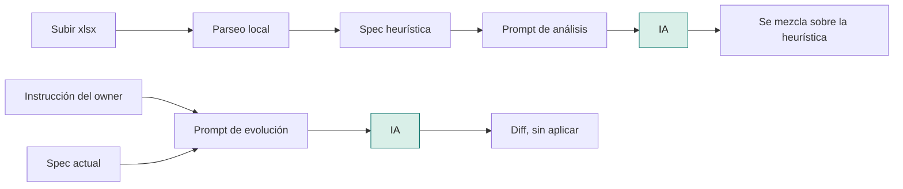
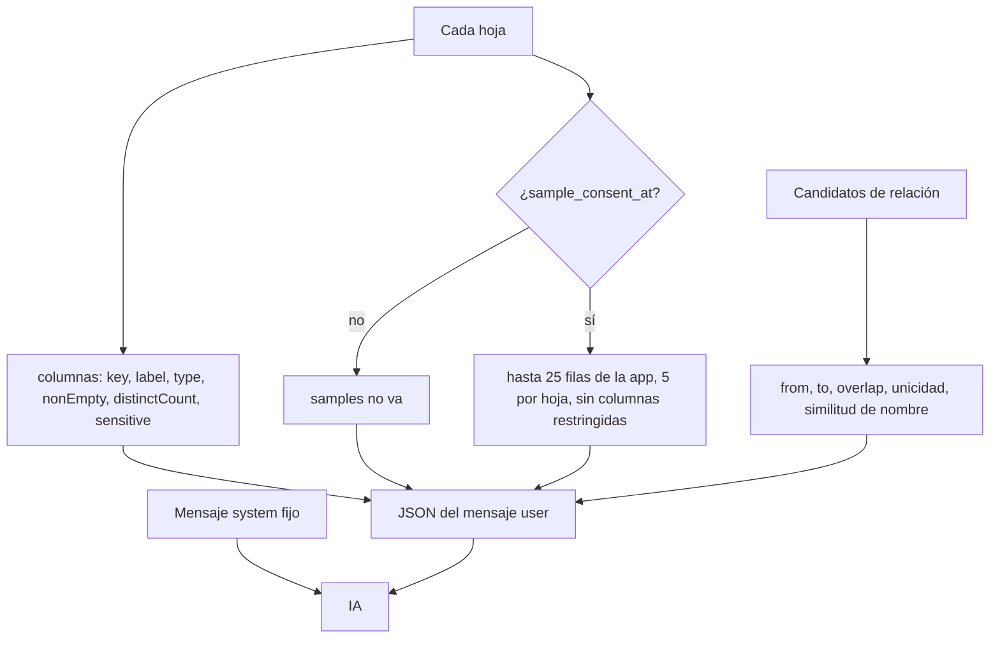
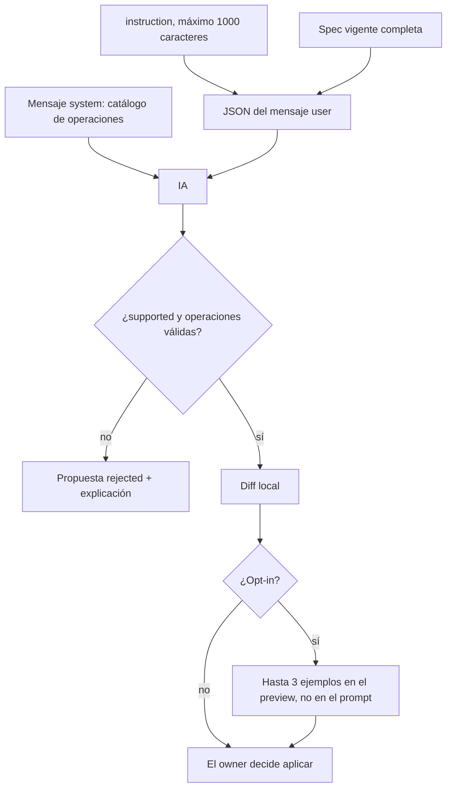

# Cómo se usa la IA

Hay dos llamadas. Las dos van a Workers AI, modelo `WORKERS_AI_MODEL` o, si no está, `@cf/meta/llama-3.1-8b-instruct-fast`. Piden JSON (`response_format: json_object`). Si hay `AI_GATEWAY_ID`, pasan por el gateway con `collectLog: false`.

Ninguna llamada manda el archivo. El prompt es un JSON que arma el servidor.



## 1. Análisis de la planilla

Corre al subir, y también si alguien llama a `POST /api/apps/:id/analyze`. La pantalla de revisión no tiene un botón que dispare esa segunda pasada.

Antes del modelo, en local:

1. Se parsea el `.xlsx`.
2. Se arma la spec heurística: una entidad por hoja, tipos inferidos, columna identificadora, estado si lo hay, vistas y, si hay un monto, un resumen. Esa spec es el piso. El modelo no la reemplaza entera.
3. Se arma el objeto que va en el mensaje de usuario.



El mensaje **system** es fijo:

> Devolvé solo JSON con title, summary, entities[{key,name,primaryFieldKey,statusFieldKey,hiddenFields}], relations[{fromEntity,fieldKey,toEntity}] y nada más. No inventes entity keys ni columnas. relations solo puede usar relationCandidates. Si no hay opt-in, no hay valores reales.

El mensaje **user** es `JSON.stringify` de este objeto:

```json
{
  "filename": "gastos.xlsx",
  "sheets": [
    {
      "entityKey": "septiembre",
      "name": "Septiembre",
      "columns": [
        { "key": "nafta", "label": "Nafta", "type": "amount", "nonEmpty": 30, "distinctCount": 12, "sensitive": false }
      ]
    }
  ],
  "relationCandidates": [
    { "fromEntity": "septiembre", "fieldKey": "patente", "toEntity": "autos", "overlapRatio": 0.8, "targetUniqueness": 1, "nameSimilarity": 0.4 }
  ]
}
```

`samples` no está en el JSON si no hay opt-in. Con opt-in es una lista de objetos `{ campo: valor }`. Se leen como máximo 25 filas de `records` y, de esas, 5 por hoja. Si el nombre o la etiqueta de la columna matchea credencial o categoría especial (salud, religión, política, sindicato, vida sexual, origen étnico), esa clave no entra en la muestra. El perfil igual marca `sensitive: true`, pero no manda el valor.

La respuesta se interpreta así:

- Se lee el texto y, si viene envuelto en `{ response }`, se desanida. Tiene que parsear como JSON.
- Sobre una copia de la heurística se aceptan solo: `title` (hasta 160), `summary` (hasta 500), y por entidad existente el nombre, `primaryFieldKey`, `statusFieldKey` y `hiddenFields`.
- Una entidad o una columna que el modelo invente se ignora.
- Una relación se acepta solo si ya estaba en los candidatos. Si acepta alguna, reemplaza la lista de relaciones de la heurística por esas.
- `hiddenFields` no puede ocultar un campo sensible o de categoría especial: esos ya nacen ocultos.
- Si el JSON no sirve, la llamada falla o no hay binding, se guarda la heurística y el origen queda `heuristic`. Si la mezcla pasa `parseAppSpec`, el origen queda `ai`.

## 2. Instrucción para evolucionar

Solo cuando el owner aprieta **Proponer cambio**. El modelo no toca datos. Devuelve operaciones, y el servidor arma el diff.



El mensaje **system** fija el catálogo: `addField`, `renameField`, `updateField`, `archiveField`, `addView`, `updateView`, `removeView`, `addWidget`, `removeWidget`, `renameEntity`, `addEntity`, `addRelation`, `removeRelation`, `convertFieldType`, `splitField`, `computeField`, `fillDefault`, `extractEntity`. Pide `{"supported":true,"operations":[...]}` o `{"supported":false,"explanation":"..."}`. No puede inventar keys que no estén en la spec, salvo campos nuevos. `computeField` solo usa `+`, `-`, `*`, `concat()`, `days()` y keys de campos. No escribe código.

El mensaje **user** es:

```json
{ "instruction": "Agregá un campo de notas", "spec": { "version": "2", "title": "gastos", "entities": [] } }
```

`spec` es la spec actual entera. No se adjuntan filas. El opt-in no cambia este prompt. Después de una respuesta válida, el preview local puede mostrar hasta 3 ejemplos de filas si hay opt-in. Esos ejemplos no se envían al modelo.

Si `supported` es false, el JSON no trae operaciones del catálogo, o no hay binding, la propuesta se guarda `rejected` con la explicación. No hay reintento automático.
