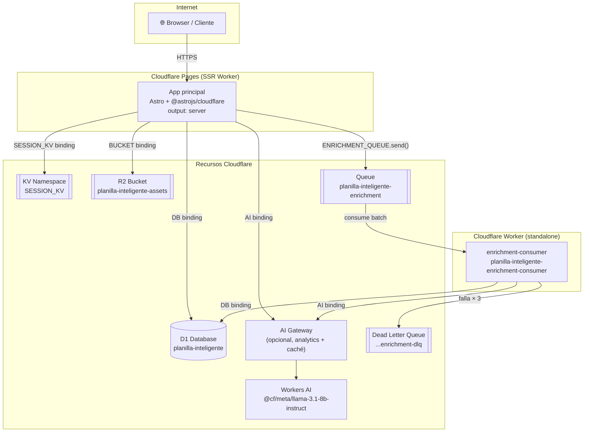
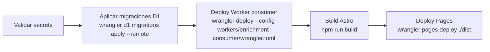

# 01 — Despliegue en Cloudflare

PlanillaInteligente corre íntegramente en la infraestructura de Cloudflare, compuesta por dos piezas desplegables independientes y cinco bindings de recursos.

## Diagrama de infraestructura

## Bindings por componente

| Binding | Tipo | Pages | Consumer |
|---------|------|:-----:|:--------:|
| `DB` | D1 Database | ✅ | ✅ |
| `SESSION_KV` | KV Namespace | ✅ | — |
| `BUCKET` | R2 Bucket | ✅ | — |
| `ENRICHMENT_QUEUE` | Queue producer | ✅ | — |
| Queue consumer | Queue consumer | — | ✅ |
| `AI` | Workers AI | ✅ | ✅ |

> **Por qué dos piezas:** Cloudflare Pages solo soporta queue *producers*. El handler `queue()` que consume mensajes debe correr como Worker independiente.

## Separación producción / preview

Cada recurso tiene una instancia separada por ambiente para evitar que un deploy a una rama `dev` toque datos de producción:

| Recurso | Producción | Preview |
|---------|-----------|---------|
| D1 | `planilla-inteligente` | `planilla-inteligente-preview` |
| KV | namespace prod | namespace preview |
| R2 | `planilla-inteligente-assets` | `planilla-inteligente-assets-preview` |
| Queue | `planilla-inteligente-enrichment` | `planilla-inteligente-enrichment-preview` |

La configuración de preview vive en `[env.preview.*]` dentro de `wrangler.toml`.

## Orden de despliegue (CI)

El workflow `.github/workflows/deploy-cloudflare-pages.yml` ejecuta los pasos en este orden para garantizar que la DB esté actualizada antes de que entre el código nuevo:

## Tolerancia a fallos

La app está diseñada para degradar graciosamente cuando algún binding no está disponible:

| Binding ausente | Comportamiento |
|-----------------|---------------|
| `ENRICHMENT_QUEUE` | Enriquecimiento corre inline en el mismo request |
| `AI` o falla del modelo | Se usa heurística semántica local como fallback |
| `SESSION_KV` | La app sigue funcionando, lee sesión desde D1 en cada request |
