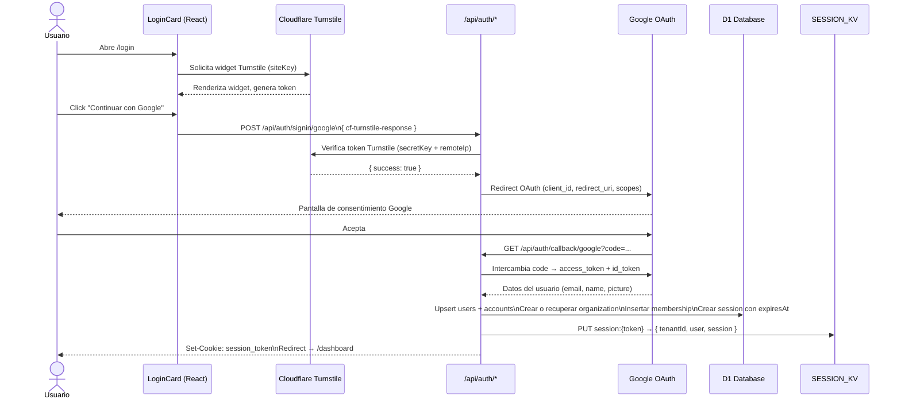
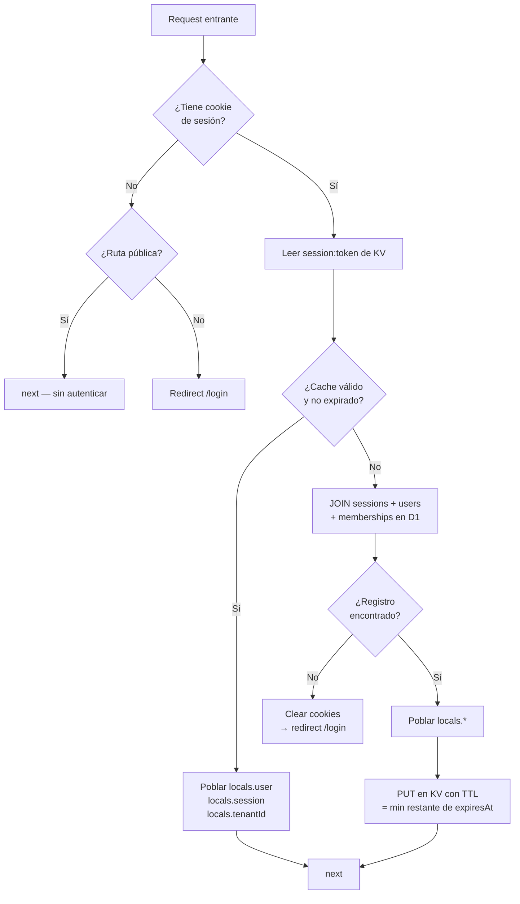

# 02 — Autenticación y gestión de sesiones

La autenticación usa Google OAuth 2.0 como único proveedor, protegida por Cloudflare Turnstile en el formulario de login. Las sesiones se persisten en D1 y se cachean en KV para reducir lecturas repetidas.

## Flujo completo de login



## Caché de sesión en KV

Cada request autenticado pasa por `src/middleware.ts`, que implementa una estrategia de caché read-through sobre KV:



**TTL del KV:** se calcula como `max(60s, segundos restantes hasta expiresAt)` para no cachear sesiones casi vencidas más de lo necesario.

## Rutas públicas vs. protegidas

El middleware define dos listas estáticas que se evalúan **antes** de buscar la sesión:

```ts
// src/middleware.ts
const PUBLIC_PATH_PREFIXES = ['/login', '/api/auth', '/favicon', '/_astro'];
const PUBLIC_PATHS = new Set(['/']);
```

Cualquier ruta que no coincida con estas listas requiere sesión válida. Si no la hay, el middleware redirige a `/login`.

## Cookies reconocidas

El middleware busca el token de sesión en estas cookies (en orden):

| Cookie | Propósito |
|--------|-----------|
| `session` | Cookie principal de sesión propia |
| `session_token` | Alias alternativo |
| `authjs.session-token` | Compatibilidad con Auth.js |

La primera cookie con valor no vacío gana.

## Variables de entorno relevantes

| Variable | Tipo | Uso |
|----------|------|-----|
| `GOOGLE_CLIENT_ID` | var pública | OAuth client ID |
| `GOOGLE_CLIENT_SECRET` | **secret** | OAuth client secret (no en wrangler.toml) |
| `TURNSTILE_SECRET_KEY` | **secret** | Verificación server-side de Turnstile |
