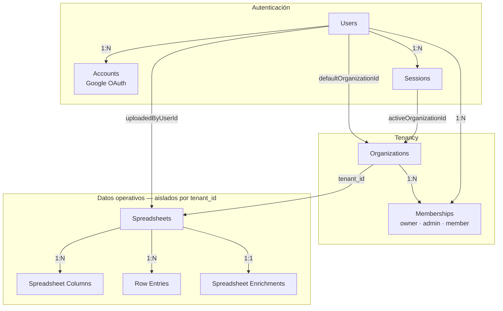
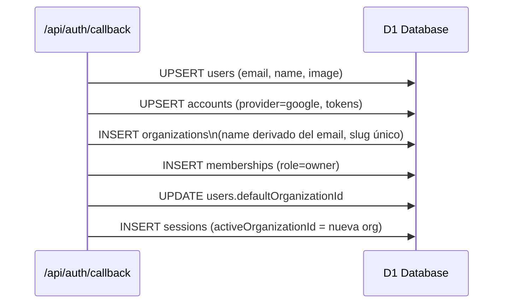

# 03 — Multi-tenancy

PlanillaInteligente es multi-tenant: cada organización tiene sus propios datos completamente aislados. El aislamiento se logra mediante un `tenant_id` presente en todas las tablas operativas.

## Modelo de entidades



## Ciclo de vida de un tenant

Cuando un usuario se autentica por primera vez, el sistema crea automáticamente:



El usuario queda como `owner` de su propia organización y puede invitar a otros miembros.

## Aislamiento de datos

Cada tabla operativa tiene una columna `tenant_id` que referencia al `id` de la organización. **Todas** las queries del código de aplicación incluyen `eq(table.tenantId, locals.tenantId)` como condición obligatoria:

```ts
// Ejemplo de query aislada por tenant
await db
  .select()
  .from(spreadsheets)
  .where(and(
    eq(spreadsheets.tenantId, locals.tenantId),   // ← aislamiento
    eq(spreadsheets.id, spreadsheetId),
  ));
```

El `tenantId` fluye desde el middleware → `locals.tenantId` → todos los handlers de API.

## Roles

| Rol | Quién lo tiene | Acceso |
|-----|---------------|--------|
| `owner` | Creador de la organización | Acceso total |
| `admin` | Invitado con privilegios | Gestión de datos |
| `member` | Miembro básico | Solo lectura (por definir) |

El rol se lee en el middleware junto con la sesión y se expone en `locals.user.role`.

## Sesión activa vs. organización por defecto

Un usuario puede pertenecer a múltiples organizaciones. El middleware usa `sessions.activeOrganizationId` para determinar qué tenant está activo en cada request, no `users.defaultOrganizationId`. El campo `defaultOrganizationId` solo se usa como destino inicial al crear la primera sesión.
