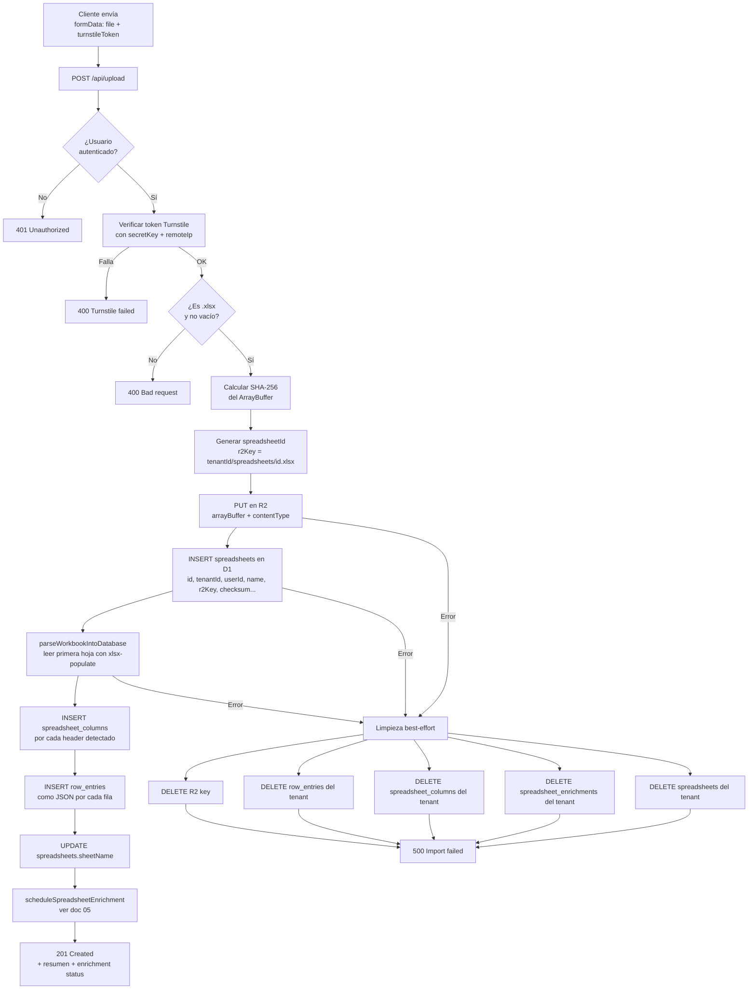
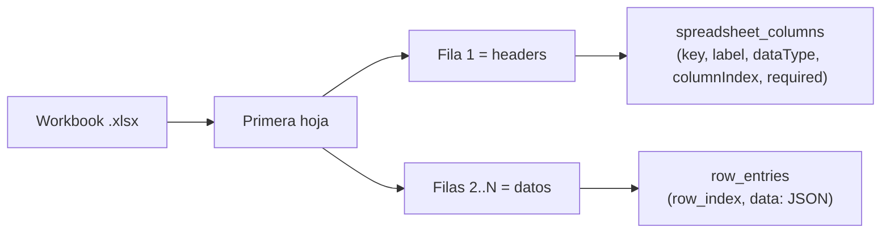

# 04 — Upload y parseo de planillas

El endpoint `POST /api/upload` es el punto de entrada principal de datos. Recibe un archivo `.xlsx`, lo valida, lo persiste en R2 y lo parsea a D1, todo dentro de una transacción lógica con limpieza best-effort en caso de fallo.

## Flujo completo



## Parseo del workbook (`parseWorkbookIntoDatabase`)

`src/spreadsheets/parsing/parse-workbook.ts` lee el workbook con `xlsx-populate`:

1. **Primera hoja**: solo se procesa la primera hoja del libro (`workbook.sheet(0)`).
2. **Headers**: la primera fila se trata como nombres de columnas. Se genera un `key` normalizado (snake_case) y un `label` legible.
3. **Tipo de dato inferido**: se detecta si la columna es `number`, `boolean`, `date` o `string` inspeccionando los valores de la columna.
4. **Matriz de celdas**: los valores se obtienen desde `worksheet.usedRange()?.value()` y luego se normalizan a una matriz procesable.
5. **Row entries**: cada fila se serializa como un objeto JSON `{ key: value }` y se inserta en `row_entries.data`.



## Limpieza best-effort (rollback)

D1 no soporta transacciones distribuidas con R2, por eso no existe un rollback atómico real entre ambos sistemas. Si el import falla en cualquier punto, el endpoint ejecuta una **limpieza best-effort en paralelo** mediante `Promise.all(...)` para intentar borrar el objeto en R2 y los registros ya insertados en D1. Los fallos de limpieza se ignoran silenciosamente para que el endpoint siempre devuelva el error original, por lo que la reversión no está garantizada.

## Validaciones aplicadas

| Validación | Criterio | Error |
|-----------|---------|-------|
| Autenticación | `locals.user && locals.tenantId` | 401 |
| Turnstile | `verification.success === true` | 400 |
| Extensión | `.xlsx` al final del nombre | 400 |
| Contenido vacío | `arrayBuffer.byteLength > 0` | 400 |
| Tipo MIME | Aceptado o fallback a `application/vnd.openxmlformats-...` | — |

## Respuesta 201

Ejemplo común cuando el enriquecimiento queda **en cola**:

```json
{
  "spreadsheetId": "uuid",
  "tenantId": "uuid",
  "r2Key": "tenantId/spreadsheets/uuid.xlsx",
  "sheetName": "Hoja1",
  "columnsCount": 8,
  "rowsCount": 142,
  "enrichment": {
    "status": "pending",
    "mode": "queue",
    "generatedBy": null,
    "model": null,
    "fallbackUsed": false,
    "errorMessage": null
  }
}
```

Si el enriquecimiento se resuelve inline, la respuesta puede llegar como `status: "completed"` y `mode: "inline"`, con `generatedBy: "workers-ai"` cuando usa Workers AI o `generatedBy: "heuristic"` junto con `fallbackUsed: true` cuando entra en fallback heurístico.
