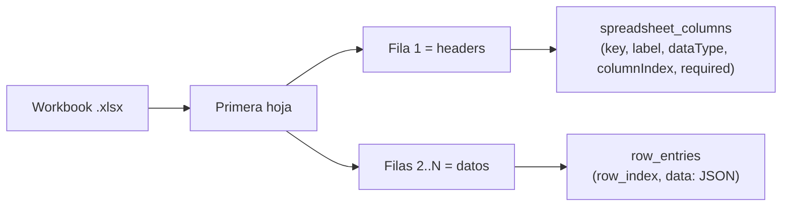

# 04 — Upload y parseo de planillas

El endpoint `POST /api/upload` es el punto de entrada principal de datos. Recibe un archivo `.xlsx`, lo valida, lo persiste en R2 y lo parsea a D1, todo dentro de una transacción lógica con rollback atómico en caso de fallo.

## Flujo completo


## Parseo del workbook (`parseWorkbookIntoDatabase`)

`src/lib/excel-parser.ts` lee el workbook con `xlsx-js-style`:

1. **Primera hoja**: solo se procesa la primera hoja del libro (`workbook.SheetNames[0]`).
2. **Headers**: la primera fila se trata como nombres de columnas. Se genera un `key` normalizado (snake_case) y un `label` legible.
3. **Tipo de dato inferido**: se detecta si la columna es `number`, `boolean`, `date` o `string` inspeccionando los valores de la columna.
4. **Row entries**: cada fila se serializa como un objeto JSON `{ key: value }` y se inserta en `row_entries.data`.



## Rollback atómico

D1 no soporta transacciones distribuidas con R2, por eso el rollback es **best-effort paralelo**: si el import falla en cualquier punto, se lanzan `Promise.all` con todas las operaciones de limpieza. Los fallos de limpieza se ignoran silenciosamente para que el endpoint siempre devuelva el error original.

## Validaciones aplicadas

| Validación | Criterio | Error |
|-----------|---------|-------|
| Autenticación | `locals.user && locals.tenantId` | 401 |
| Turnstile | `verification.success === true` | 400 |
| Extensión | `.xlsx` al final del nombre | 400 |
| Contenido vacío | `arrayBuffer.byteLength > 0` | 400 |
| Tipo MIME | Aceptado o fallback a `application/vnd.openxmlformats-...` | — |

## Respuesta 201

```json
{
  "spreadsheetId": "uuid",
  "tenantId": "uuid",
  "r2Key": "tenantId/spreadsheets/uuid.xlsx",
  "sheetName": "Hoja1",
  "columnsCount": 8,
  "rowsCount": 142,
  "enrichment": {
    "status": "completed",
    "mode": "inline",
    "generatedBy": "ai",
    "model": "@cf/meta/llama-3.1-8b-instruct",
    "fallbackUsed": false,
    "errorMessage": null
  }
}
```
