# 05 — Enriquecimiento IA

El enriquecimiento analiza la estructura de una planilla (columnas + muestra de filas) e infiere metadata de UI: tipos semánticos por columna, vista recomendada (tabla/kanban/dashboard), título y resumen. El resultado se persiste en `spreadsheet_enrichments`.

## Arquitectura general

```mermaid
graph LR
    Upload["POST /api/upload\no POST /api/ai/enrichment"] --> SE["scheduleSpreadsheetEnrichment\nsrc/lib/spreadsheet-enrichment.ts"]

    SE -->|"ENRICHMENT_QUEUE\ndisponible"| Q["Queue\nplanilla-inteligente-enrichment"]
    SE -->|"sin queue\no falla"| Inline["runSpreadsheetEnrichment\ninline en el request"]

    Q --> Consumer["Worker consumer\nworkers/enrichment-consumer/\nmax_batch=10, timeout=30s, retries=3"]
    Consumer --> Run["runSpreadsheetEnrichment"]
    Inline --> Run

    Run --> Ctx["Construir contexto:\n- nombre + sheetName\n- columnas (key, label, dataType)\n- hasta 5 filas de muestra\n  (valores sensibles REDACTED)"]
    Ctx --> AI{Workers AI\ndisponible?}
    AI -->|"Sí"| LLM["AI.run(model, prompt)\n@cf/meta/llama-3.1-8b-instruct\nopc. vía AI Gateway"]
    AI -->|"No / falla"| Heuristic["Heurística semántica\nlocal (fallback)"]
    LLM -->|"Éxito"| Normalize["Normalizar JSON de IA\nvalidar tipos permitidos"]
    LLM -->|"Falla"| Heuristic
    Normalize --> Persist["UPDATE spreadsheet_enrichments\nstatus=completed, config=JSON"]
    Heuristic --> Persist
    Persist --> Done["✓ Enriquecimiento\npersistido"]

    Consumer -->|"falla × 3"| DLQ["Dead Letter Queue\n...enrichment-dlq"]
```



## Modos de ejecución

| Modo | Cuándo se usa | Ventaja |
|------|-------------|---------|
| **Queue (asíncrono)** | Cuando `ENRICHMENT_QUEUE` está disponible | No bloquea el response del upload |
| **Inline (síncrono)** | Sin queue, o llamada manual con `mode: "inline"` | Resultado disponible de inmediato |

La función `scheduleSpreadsheetEnrichment` elige automáticamente: intenta encolar y, si falla, cae a inline.

## Contexto que se envía a la IA

```mermaid
flowchart TD
    A[Leer spreadsheet + columnas\ndesde D1] --> B[Leer hasta 5 row_entries\ncomo muestra]
    B --> C{¿Columna tiene\npatrón sensible?}
    C -->|"password|token|secret\ndni|rut|card..."| D["Reemplazar valores\npor &#91;REDACTED&#93;"]
    C -->|"No sensible"| E[Incluir valor real]
    D & E --> F["Prompt al LLM:\n- Nombre y hoja de la planilla\n- Lista de columnas con tipo\n- Filas de muestra sanitizadas\n- Instrucción: devolver JSON con\n  viewType, columns[semanticType], title, summary"]
```



## Heurística semántica (fallback)

Cuando la IA no está disponible, se aplican patrones regex sobre el nombre de cada columna:

| Patrón | `semanticType` asignado |
|--------|------------------------|
| `email\|correo\|mail` | `email` |
| `amount\|monto\|price\|total` | `amount` |
| `status\|estado\|stage` | `status` |
| `date\|fecha\|deadline` | `date` |
| `category\|tipo\|segment` | `category` |
| `owner\|responsable\|agent` | `assignee` |
| `phone\|telefono\|celular` | `phone` |
| `url\|link\|website` | `url` |
| `^id$\|_id$\|folio\|sku` | `identifier` |
| `name\|nombre\|cliente\|empresa` | `name` |
| `description\|notes\|comentario` | `long-text` |

La vista recomendada también se deriva por heurística: si hay columna `status`, se recomienda `kanban`; si hay `amount`, `dashboard`; si no, `table`.

## Worker consumer

Configurado en `workers/enrichment-consumer/wrangler.toml`:

```
max_batch_size    = 10   (mensajes por batch)
max_batch_timeout = 30s  (espera máxima antes de procesar batch incompleto)
max_retries       = 3    (reintentos antes de enviar al DLQ)
dead_letter_queue = planilla-inteligente-enrichment-dlq
```

El consumer comparte el mismo D1 y AI binding que la app principal, pero **no** accede a R2 ni a SESSION_KV.

## API manual de enriquecimiento

`POST /api/ai/enrichment` permite re-disparar el enriquecimiento sobre una planilla existente:

```json
{ "spreadsheetId": "uuid", "mode": "queue" }
```

Ejemplo de respuesta cuando se usa `mode: "queue"` y el trabajo queda encolado:

```json
{
  "status": "pending",
  "mode": "queue",
  "generatedBy": null,
  "model": null,
  "fallbackUsed": false,
  "errorMessage": null,
  "config": null
}
```

Ejemplo de respuesta cuando se usa `mode: "inline"` y Workers AI está disponible:

```json
{
  "status": "completed",
  "mode": "inline",
  "generatedBy": "workers-ai",
  "model": "@cf/meta/llama-3.1-8b-instruct",
  "fallbackUsed": false,
  "errorMessage": null,
  "config": {
    "...": "SpreadsheetEnrichmentConfiguration"
  }
}
```

`GET /api/ai/enrichment?spreadsheetId=uuid` devuelve el estado actual del enriquecimiento como `SpreadsheetEnrichmentOutcome`.

## Variables de entorno relevantes

| Variable | Tipo | Uso |
|----------|------|-----|
| `WORKERS_AI_MODEL` | var pública | Modelo a usar (default: `@cf/meta/llama-3.1-8b-instruct`) |
| `AI_GATEWAY_ID` | var pública | Si está presente, rutas de AI van por AI Gateway |
| `AI` | binding | Workers AI binding |
| `ENRICHMENT_QUEUE` | binding | Queue producer en Pages |
