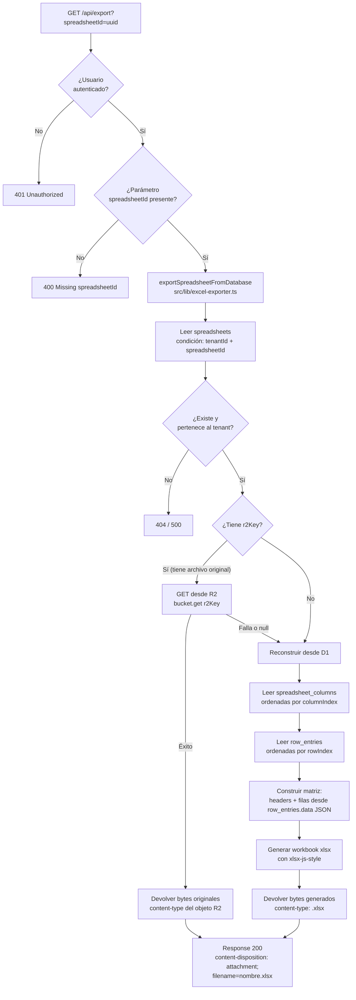

# 06 — Exportación de planillas

El endpoint `GET /api/export` reconstruye el archivo `.xlsx` original desde los datos almacenados en D1 y R2, y lo devuelve como descarga directa.

## Flujo



## Estrategia de reconstrucción

El exportador prioriza el archivo original guardado en R2:

1. **R2 disponible**: devuelve los bytes tal cual fueron subidos, preservando formato, estilos y fórmulas del Excel original.
2. **R2 no disponible o sin `r2Key`**: reconstruye el workbook a partir de los datos normalizados en D1. El resultado es un xlsx funcional pero sin estilos ni fórmulas originales.

## Content-Disposition

El header se construye con doble codificación para máxima compatibilidad entre browsers:

```
content-disposition: attachment; filename="nombre.xlsx"; filename*=UTF-8''nombre%20con%20espacios.xlsx
```

- `filename="..."` — compatibilidad con browsers antiguos (caracteres `"` y saltos de línea reemplazados por `_`)
- `filename*=UTF-8''...` — RFC 5987, soporta caracteres Unicode

## Aislamiento por tenant

La query inicial siempre incluye `tenantId` como condición:

```ts
db.select()
  .from(spreadsheets)
  .where(and(
    eq(spreadsheets.tenantId, tenantId),   // ← aislamiento
    eq(spreadsheets.id, spreadsheetId),
  ))
```

Esto garantiza que un tenant no pueda exportar planillas de otro tenant aunque conozca el `spreadsheetId`.
