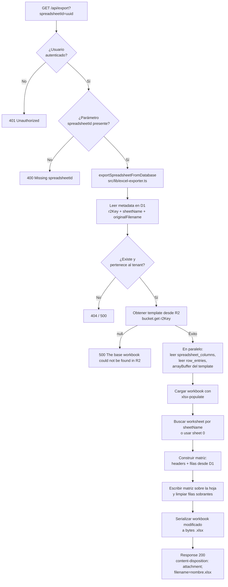

# 06 — Exportación de planillas

El endpoint `GET /api/export` toma el workbook base desde R2, lo actualiza con los datos actuales almacenados en D1 y devuelve el resultado como descarga directa.

## Flujo



## Estrategia de reconstrucción

El exportador no tiene dos caminos alternativos. Siempre sigue esta estrategia:

1. **Lee metadata de la planilla en D1** para obtener `r2Key`, `sheetName` y `originalFilename`.
2. **Descarga el template desde R2** con `bucket.get(spreadsheet.r2Key)`. Si el objeto no existe, el export falla con error 500; no hay fallback.
3. **Lee en paralelo las columnas y filas desde D1** mientras convierte el template de R2 a `ArrayBuffer`.
4. **Carga el workbook con `xlsx-populate`** y selecciona la hoja por `sheetName`, con fallback a la hoja `0` si ese nombre no está presente.
5. **Escribe el header y las filas actuales desde D1** sobre la hoja del template, limpiando filas antiguas sobrantes.
6. **Devuelve una copia modificada del workbook original**: se reutiliza el template de R2, pero siempre actualizado con los datos más recientes de D1.

## Content-Disposition

El header se construye con doble codificación para máxima compatibilidad entre browsers:

```
content-disposition: attachment; filename="nombre.xlsx"; filename*=UTF-8''nombre%20con%20espacios.xlsx
```

- `filename="..."` — compatibilidad con browsers antiguos (caracteres `"` y saltos de línea reemplazados por `_`)
- `filename*=UTF-8''...` — RFC 5987, soporta caracteres Unicode

## Aislamiento por tenant

La query inicial siempre incluye `tenantId` como condición:

```ts
db.select()
  .from(spreadsheets)
  .where(and(
    eq(spreadsheets.tenantId, tenantId),   // ← aislamiento
    eq(spreadsheets.id, spreadsheetId),
  ))
```

Esto garantiza que un tenant no pueda exportar planillas de otro tenant aunque conozca el `spreadsheetId`.
