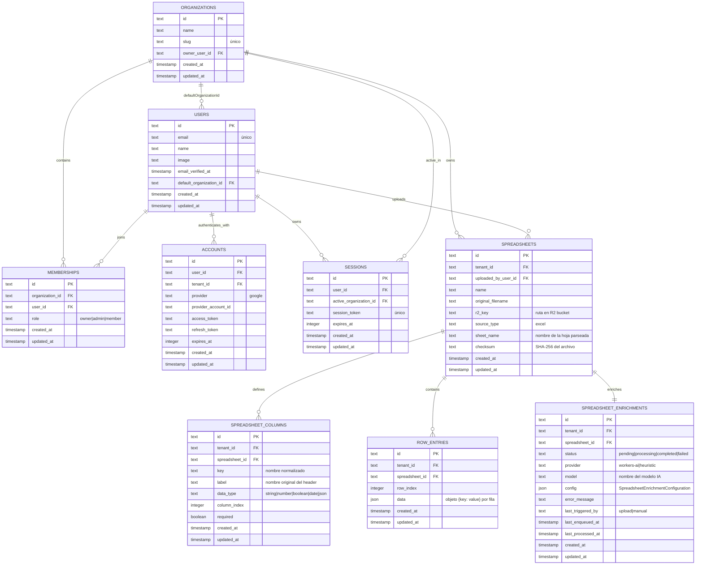

# 07 — Modelo de datos

Todas las tablas viven en D1 (SQLite gestionado por Cloudflare). El esquema está definido en `src/db/schema.ts` con Drizzle ORM y las migraciones se generan con `npm run db:generate`.

## Diagrama ER completo



## Ideas clave

### Aislamiento multi-tenant
Todas las tablas operativas (`SPREADSHEETS`, `SPREADSHEET_COLUMNS`, `ROW_ENTRIES`, `SPREADSHEET_ENRICHMENTS`) incluyen `tenant_id`. Todas las queries del código incluyen este campo como filtro obligatorio.

### Esquema dinámico
El esquema de cada planilla vive en `SPREADSHEET_COLUMNS`, no en columnas fijas de la DB. Esto permite importar cualquier planilla sin migraciones adicionales.

### Datos flexibles
Las filas se almacenan en `ROW_ENTRIES.data` como JSON `{ key: value }`. Las claves corresponden a los `key` de `SPREADSHEET_COLUMNS`, lo que permite reconstruir la tabla original en cualquier momento.

### Separación de metadata de UI
`SPREADSHEET_ENRICHMENTS.config` guarda las sugerencias de IA (tipos semánticos, vista recomendada, título) sin mezclarlas con los datos operativos de `ROW_ENTRIES`. Esto permite re-enriquecer sin tocar los datos.

### Estructura de `config` (SpreadsheetEnrichmentConfiguration)
```ts
{
  title: string
  summary: string
  viewType: 'table' | 'kanban' | 'dashboard' | 'calendar' | 'gallery'
  columns: Array<{
    key: string
    semanticType: 'email' | 'amount' | 'status' | 'date' | 'category' |
                  'assignee' | 'phone' | 'url' | 'identifier' | 'name' |
                  'long-text' | 'generic'
    displayAs?: string
    isPrimary?: boolean
    isGroupBy?: boolean
  }>
}
```

## Migraciones

```bash
npm run db:generate   # genera SQL en migrations/ a partir de src/db/schema.ts
npm run db:migrate    # aplica las migraciones en producción (--remote)
```

Las migraciones se aplican como **primer paso** en el pipeline de CI antes de desplegar código nuevo. Ver [01-despliegue-cloudflare.md](./01-despliegue-cloudflare.md).
