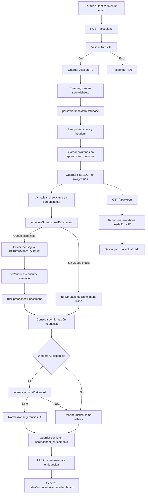

# Flujo de generación y enriquecimiento de la app

Este diagrama resume cómo una planilla se transforma en la base de una aplicación multi-tenant dentro de PlanillaInteligente.

## Resultado

- `spreadsheet_columns` define la estructura dinámica.
- `row_entries` almacena los datos operativos del tenant.
- `spreadsheet_enrichments` guarda metadata de UI y sugerencias IA para mejorar la app generada.
