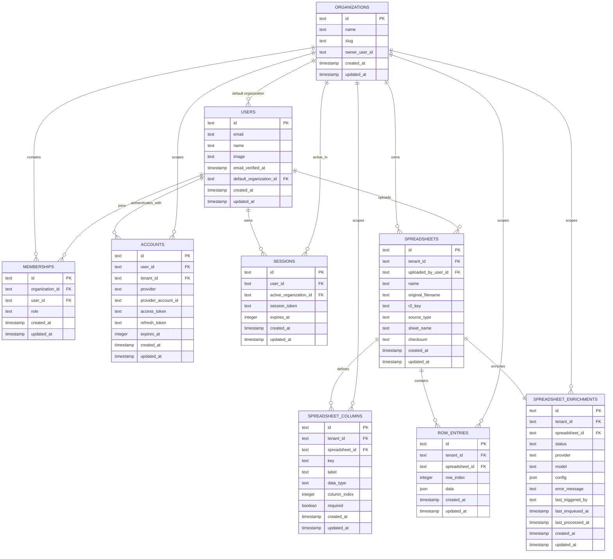

> ⚠️ **DEPRECADO** — Este documento ya no se mantiene.
> Ver el reemplazo en `docs/architecture/`:
> - [07-modelo-datos.md](./architecture/07-modelo-datos.md) — diagrama ER completo y actualizado

---

# Modelo de datos multi-tenant

Este diagrama muestra las entidades principales persistidas en D1 y sus relaciones para autenticación, tenancy, planillas y enriquecimiento IA.

## Ideas clave

- Todas las tablas operativas relevantes usan `tenant_id` para aislar organizaciones.
- El esquema dinámico vive en `spreadsheet_columns`.
- Las filas flexibles viven en `row_entries.data` como JSON.
- La capa de IA persiste sugerencias y estado en `spreadsheet_enrichments` sin mezclar UI metadata con datos operativos.
